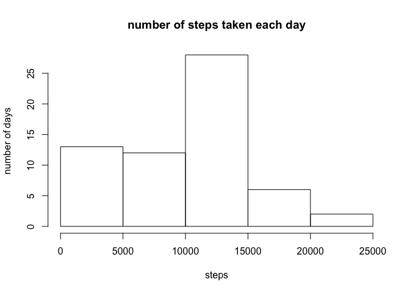
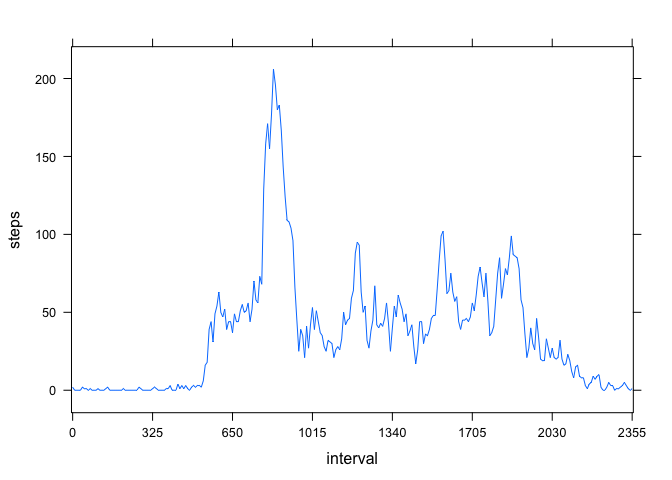
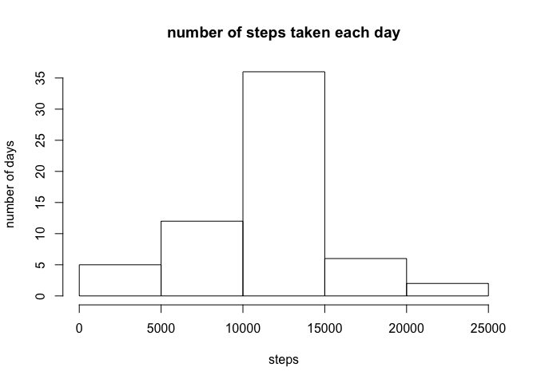
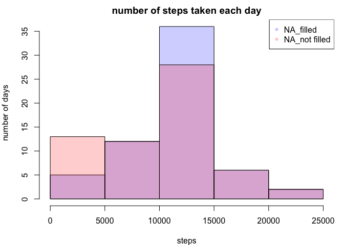
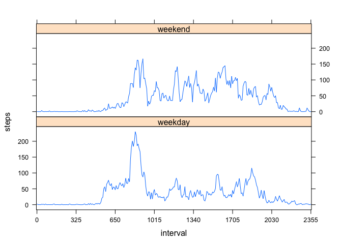

# Reproducible Research: Peer Assessment 1


## Loading and preprocessing the data  

1. Load the data

```r
download.file("https://d396qusza40orc.cloudfront.net/repdata%2Fdata%2Factivity.zip", destfile ="activity.zip", method = 'curl' )

unzip("activity.zip")

activity <- read.csv("activity.csv")
library(lattice)
```

2. Process/transform the data (if necessary) into a format suitable for your analysis

```r
activity$date <- as.Date(activity$date)
activity$interval <- as.factor(activity$interval)
```


## What is mean total number of steps taken per day?

1. Calculate the total number of steps taken per day

```r
stepsSUM <- with(activity, tapply(steps, date, sum, na.rm = TRUE))
```

2. Make a histogram of the total number of steps taken each day

```r
hist(stepsSUM, main = "number of steps taken each day", xlab = "steps", ylab = "number of days")
```

<!-- -->

3. Calculate and report the mean and median of the total number of steps taken per day

**The mean of the total number of steps taken per day is '9354.2295082' and the median is '10395'.**
        
## What is the average daily activity pattern?

1. Make a time series plot (i.e. 𝚝𝚢𝚙𝚎 = "𝚕") of the 5-minute interval (x-axis) and the average number of steps taken, averaged across all days (y-axis)

```r
# caculate means of steps per interval
stepInterval <- aggregate(activity[,1], list(interval = activity$interval), mean, na.rm = TRUE) 
names(stepInterval)[2] <- "steps"
stepInterval$steps <- round(stepInterval$steps)

# draw plot of a day
xyplot(steps~interval, type = 'l', data = stepInterval, scales = list(x = list(at=c(1,42,83,124,165,206,247,288),labels = stepInterval$interval[c(1,42,83,124,165,206,247,288)])))
```

<!-- -->

2. Which 5-minute interval, on average across all the days in the dataset, contains the maximum number of steps?

**5-min interval '835' contains the maximum number of steps**

## Imputing missing values

1. Calculate and report the total number of missing values in the dataset (i.e. the total number of rows with 𝙽𝙰s)

```r
sum(is.na(activity$steps))
```

```
## [1] 2304
```

2. Devise a strategy for filling in all of the missing values in the dataset. The strategy does not need to be sophisticated. For example, you could use the mean/median for that day, or the mean for that 5-minute interval, etc.

**fill every NA with mean of the same intervals in other days**
        
3. Create a new dataset that is equal to the original dataset but with the missing data filled in.

```r
for(i in 1:nrow(activity)){
        if(is.na(activity$steps[i]) ==TRUE){
                activity$steps[i] = stepInterval$steps[stepInterval$interval==activity$interval[i]]
        }
}
```
        
4. Make a histogram of the total number of steps taken each day and Calculate and report the mean and median total number of steps taken per day. Do these values differ from the estimates from the first part of the assignment? What is the impact of imputing missing data on the estimates of the total daily number of steps?


```r
# re-calculate the sum of the steps per day after filling NAs
stepsSUM_filled = with(activity, tapply(steps, date, sum, na.rm = TRUE))
# make a histogram
hist(stepsSUM_filled, main = "number of steps taken each day", xlab = "steps", ylab = "number of days")
```

<!-- -->

**The mean of the total number of steps taken per day is '1.0765639\times 10^{4}' and the median is '1.0762\times 10^{4}'.**

#comparing difference between the NA-filled data and not-filled one.

```r
# make new dataframe with two different stepsSUM
newSteps <- data.frame(cbind(stepsSUM, stepsSUM_filled))

par(mar=c(4,4,2,1))

# overlay two histograms
hist(stepsSUM_filled, col = adjustcolor('blue', alpha = 0.2), main = "number of steps taken each day", xlab = "steps", ylab = "number of days")
hist(stepsSUM, col = adjustcolor('red', alpha = 0.2), main = "number of steps taken each day", xlab = "steps", ylab = "number of days", add= TRUE)

# annotate legend
legend("topright", legend=c("NA_filled", "NA_not filled"), col = adjustcolor(c("blue", "red"), alpha = 0.2), pch = 20)
```

<!-- -->

**Once NAs are filled, number of days counted low-steps are taken into account as middle-steps days**

## Are there differences in activity patterns between weekdays and weekends?

1. Create a new factor variable in the dataset with two levels – “weekday” and “weekend” indicating whether a given date is a weekday or weekend day.

```r
for(i in 1:nrow(activity)){
        if(weekdays(activity$date[i]) %in% c("Monday", "Tuesday", "Wednesday", "Thursday", "Friday")){
                activity$day[i] = "weekday"
        }else{
                activity$day[i] = "weekend"
        }
}

activity$day = as.factor(activity$day)
```

2. Make a panel plot containing a time series plot (i.e. 𝚝𝚢𝚙𝚎 = "𝚕") of the 5-minute interval (x-axis) and the average number of steps taken, averaged across all weekday days or weekend days (y-axis). See the README file in the GitHub repository to see an example of what this plot should look like using simulated data.


```r
stepInterval2 <- aggregate(activity[,1:2], list(interval = activity$interval, day = activity$day) ,mean)
xyplot(steps~interval |day, data = stepInterval2, type = 'l', layout=c(1,2), scales = list(x = list(at=c(1,42,83,124,165,206,247,288), labels = stepInterval2$interval[c(1,42,83,124,165,206,247,288)])))
```

<!-- -->

